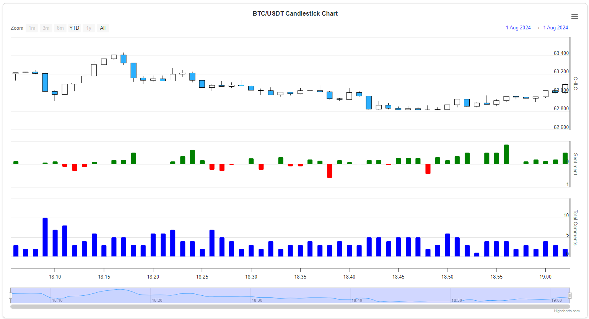

# Real-Time BTC Price Visualization and Sentiment Analysis

## Overview

This project, developed by our team, leverages AWS services to provide real-time visualization of Bitcoin (BTC) prices alongside sentiment analysis of Reddit posts discussing BTC. The key features include:

- **Real-Time BTC Price Visualization**: The project uses Highcharts to create candlestick charts that display real-time BTC price data.
- **Sentiment Analysis**: Reddit posts containing BTC comments are analyzed for sentiment. The sentiment data is displayed in tandem with the price data, providing a comprehensive view of market trends and public perception.

## Architecture


The architecture consists of the following components:

- **AWS Lambda**: Functions for processing data and orchestrating various tasks.
- **Amazon S3**: Storage for historical data and processed results.
- **Amazon RDS**: Database for storing structured data.
- **Docker Containers**: Running sentiment analysis with spaCy and other dependencies.
- **AWS EventBridge**: To manage and route events between different AWS services.
- **Amazon EC2**: For hosting applications and running compute workloads.
- **Amazon ECS**: For container orchestration and managing Docker containers.
- **AWS API Gateway**: For creating, deploying, and managing secure APIs.

- **Highcharts**: Frontend library for rendering the candlestick and volume charts.
- **APIs**:
  - **Binance API**: For fetching real-time BTC price data.
  - **Reddit API**: For extracting posts and comments related to BTC

## Features

1. **Candlestick Chart and Sentiment Analysis**:
   - Visualizes real-time BTC prices using Highcharts.
   - Provides various time frame views (1m, 3m, 6m, YTD, 1y, All).
   - Analyzes Reddit posts mentioning BTC for sentiment (positive, negative, neutral).
   - Displays sentiment data below the candlestick chart.



2. **Comparing Assets Charts**:
   - Displays the trading volume of BTC.
   - Provides insights into market activity.


3. **Bitcoin Prices and Moon Phases**:
   - Visualizes Bitcoin price trends in relation to moon phases.
   - Allows for date range selection to update the chart dynamically


## Technology Stack

- **AWS Services**:
  - **AWS Lambda**: For serverless computing and data processing.
  - **Amazon S3**: For storing and retrieving data.
  - **AWS EventBridge**: To manage and route events between different AWS services.
  - **Amazon EC2**: For hosting applications and running compute workloads.
  - **Amazon ECS**: For container orchestration and managing Docker containers.
  - **AWS API Gateway**: For creating, deploying, and managing secure APIs.

- **Data Sources**:
  - **Binance API**: For fetching real-time BTC price data.
  - **Reddit API**: For extracting posts and comments related to BTC.

- **Visualization**:
  - **Highcharts**: For rendering interactive candlestick and volume charts.

## Getting Started

### Prerequisites

- AWS Account
- Python 3.x
- Highcharts
- Access to Binance and Reddit APIs

### Installation

1. Clone the repository:

```bash
   git clone https://github.com/your-repo/btc-visualization-sentiment-analysis.git
   cd btc-visualization-sentiment-analysis
```
